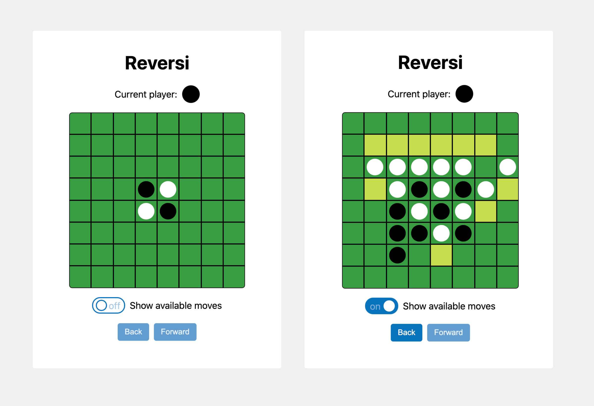
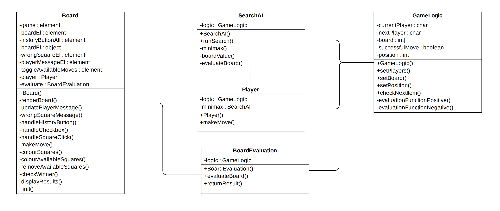

# Reversi
A simple game built in JavaScript. It was developed to explore how the minimax algorithm can generate moves so the user can play against the computer.

## Rules of the game
Flip as many of your opponent's pieces as possible.

Reversi is played on an 8x8 board with discs that are white on one side and black on the other. One player is assigned the colour white and the other player is assigned the colour black. The aim of the game is to have the highest number of discs showing your colour when all squares are taken. This is achieved by flipping your opponent’s discs to show your colour.

To flip your opponent’s disc you must surround their disc(s) with your own so that the opponent’s disc(s) are flanked by yours in at least one direction. This can happen horizontally, vertically, or diagonally.

If one player is unable to take a move, i.e. there are no available squares, the other player is declared the winner.

## Screenshots

## Diagrams

